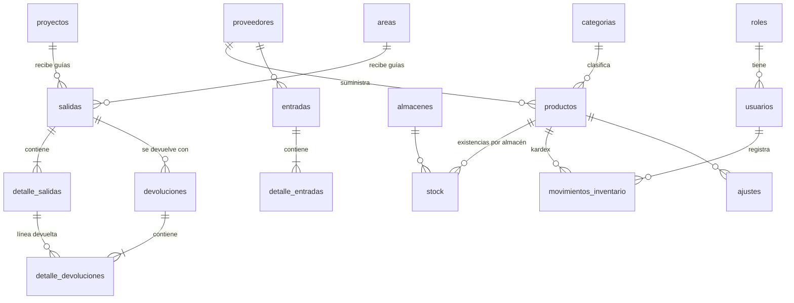

# ERP de Inventario

Sistema de gestión de inventario con control de **entradas**, **guías de salida** (a proyectos o áreas), **devoluciones**, **Kardex**, **alertas** y **reportes**.

- **Frontend:** React 18 + Vite + Tailwind CSS
- **Backend:** Node.js + Express (API REST, JWT)
- **Base de datos:** PostgreSQL

---

## 1. Puesta en marcha (local)

### Requisitos
- Node.js 18 o superior
- PostgreSQL 13 o superior (en ejecución)

### Backend
```bash
cd backend
cp .env.example .env          # en Windows: copy .env.example .env
# Edite DATABASE_URL con su usuario y contraseña de PostgreSQL
npm install
npm run db:reset              # crea la BD, las tablas y carga datos de prueba
npm run dev                   # API en http://localhost:4000/api
```

> `db:reset` **borra y recrea** todas las tablas de la base indicada en `DATABASE_URL`. Úselo solo en una base dedicada a este sistema.

### Frontend (otra terminal)
```bash
cd frontend
npm install
npm run dev                   # abre http://localhost:5173
```
Vite redirige `/api` al backend en el puerto 4000, así que no se necesita configurar CORS en desarrollo.

### Usuarios de prueba
| Rol | Correo | Contraseña |
|---|---|---|
| Administrador | admin@erp.com | admin123 |
| Almacén | almacen@erp.com | almacen123 |
| Supervisor | supervisor@erp.com | supervisor123 |

Los datos de prueba incluyen 21 productos, 3 proyectos, 2 almacenes, entradas, guías despachadas, una guía pendiente (stock comprometido), una guía anulada, devoluciones con productos dañados y defectuosos, ajustes, productos con stock bajo, uno agotado, herramientas con devolución vencida y un intento de salida rechazado. Todo se genera con los mismos servicios que usa la API, así que stock y Kardex cuadran.

---

## 2. Arquitectura

```
React + Tailwind (SPA)  ──HTTP/JSON + JWT──►  Express API  ──►  PostgreSQL
  páginas · componentes                        rutas → middleware (auth, rol, validación Zod)
  contexto de sesión · axios                   → controladores → servicios → modelos (SQL)
```

- **Rutas:** definen el endpoint, el rol permitido y el esquema de validación.
- **Controladores:** leen la petición y devuelven la respuesta, sin lógica de negocio.
- **Servicios:** contienen las reglas de negocio. Cada operación de stock corre en una transacción.
- **Modelos:** contienen las consultas SQL.

**`services/inventarioService.js`** es el único código que modifica la tabla `stock`. Hace dos cosas en la misma transacción:
- Bloquea la fila con `SELECT … FOR UPDATE`.
- Escribe el movimiento en el Kardex.

Por eso stock e historial nunca se desincronizan, y dos guías simultáneas no pueden dejar el stock en negativo. La base de datos refuerza la regla con `CHECK (… >= 0)`.

---

## 3. Modelo de base de datos



| Tabla | Claves y restricciones principales |
|---|---|
| `stock` | PK (producto_id, almacen_id). Columnas `disponible`, `comprometido`, `danado`, `defectuoso`, todas con `CHECK ≥ 0` |
| `salidas` (guía) | `numero` UNIQUE, `estado` ∈ PENDIENTE / DESPACHADA / ANULADA. `chk_destino` exige proyecto **o** área según `tipo_destino` |
| `detalle_salidas` | `cantidad > 0`. `cantidad_devuelta ≤ cantidad` (`chk_devuelta`). UNIQUE (salida, producto) |
| `devoluciones` | `salida_id` NOT NULL: siempre vinculada a una guía |
| `detalle_devoluciones` | FK a la línea de la guía. `estado_producto` ∈ BUENO / DANADO / DEFECTUOSO |
| `movimientos_inventario` | Kardex: entrada, salida, devolución, saldo (≥ 0), costo unitario, valor y usuario |

El esquema completo está en `backend/db/schema.sql`.

---

## 4. Flujos y reglas de negocio

**Entrada:** proveedor → registro con varias líneas → `disponible += cantidad` → recálculo del costo promedio ponderado → Kardex.

**Guía de salida (proyecto o área):**
1. Almacén registra la guía con los productos requeridos.
2. Se valida el stock de cada línea. Si **una sola** excede el disponible, se rechaza la guía completa. Se muestran los faltantes y se genera una alerta.
3. Hay dos opciones al registrar:
   - **Registrar y despachar:** el stock baja al instante y se escribe el Kardex.
   - **Guardar pendiente:** el stock pasa de *disponible* a *comprometido* hasta que se despache o se anule.
4. Una guía despachada **no se edita**. Se corrige de dos formas:
   - **Anulación:** solo supervisor o administrador. Reintegra lo que no fue devuelto.
   - **Devolución.**

**Devolución:**
1. Se elige una guía despachada y se muestran sus líneas con lo pendiente de devolver.
2. Una misma línea puede devolverse en partes con distintos estados.
3. El total por línea no puede superar `cantidad − cantidad_devuelta`.
4. El destino del stock depende del estado:
   - BUENO → `disponible`
   - DAÑADO → `danado`
   - DEFECTUOSO → `defectuoso`
5. Se escribe el Kardex.

**Ajustes** (supervisor o administrador):
- Incremento o disminución del disponible, por ejemplo tras un conteo físico.
- Baja definitiva de unidades dañadas o defectuosas.

**Kardex:** el saldo es el stock físico del almacén (disponible + comprometido + dañado + defectuoso). Una reserva no es un movimiento físico, por eso no aparece en el Kardex.

---

## 5. Roles

| Acción | Admin | Almacén | Supervisor |
|---|:-:|:-:|:-:|
| Consultar inventario, Kardex, historial, alertas | ✔ | ✔ | ✔ |
| Registrar entradas, guías y devoluciones; despachar guías | ✔ | ✔ | |
| Anular entradas y guías; registrar ajustes | ✔ | | ✔ |
| Crear y editar proyectos | ✔ | | ✔ |
| Reportes y exportación | ✔ | | ✔ |
| Productos, catálogos y usuarios | ✔ | | |

Los permisos se validan en el backend (`middleware/roles.js`). El frontend solo oculta lo que el usuario no puede usar.

---

## 6. API REST (prefijo `/api`)

| Método | Ruta | Descripción |
|---|---|---|
| POST | `/auth/login` | Inicia sesión → `{ token, user }` |
| GET | `/auth/me` | Usuario de la sesión |
| GET | `/dashboard` · `/dashboard/alertas` | KPIs, series y alertas |
| CRUD | `/productos` (+ `PATCH /:id/estado`) | Productos con stock agregado |
| CRUD | `/categorias` `/proveedores` `/almacenes` `/areas` | Catálogos |
| CRUD | `/proyectos` · `GET /proyectos/:id` | Proyecto con guías y consumo |
| GET/POST | `/entradas` · `POST /entradas/:id/anular` | Entradas |
| GET/POST | `/salidas` · `POST /:id/despachar` · `POST /:id/anular` | Guías de salida |
| GET/POST | `/devoluciones` | Devoluciones |
| GET | `/inventario/stock` · `/inventario/kardex/:productoId` · `/inventario/movimientos` | Consultas de inventario |
| GET/POST | `/inventario/ajustes` | Ajustes |
| GET | `/reportes` · `/reportes/:id?desde&hasta&formato=json\|csv\|xlsx` | Reportes |
| GET/POST/PUT | `/usuarios` | Usuarios (admin) |

Los errores devuelven `{ message, details }` con el código HTTP correspondiente:

| Código | Significado |
|---|---|
| 400 | Validación: `details` trae la lista de campos |
| 401 / 403 | Sesión o permisos |
| 409 | Regla de negocio: stock insuficiente, cantidad devuelta excedida, etc. |

---

## 7. Estructura de carpetas

```
erp-inventario/
├── backend/
│   ├── db/            schema.sql · setup.js · seed.js
│   └── src/
│       ├── config/        conexión a PostgreSQL y variables de entorno
│       ├── middleware/    auth (JWT), roles, validate (Zod), errorHandler
│       ├── routes/        un archivo por módulo
│       ├── controllers/
│       ├── services/      inventarioService.js ← núcleo de stock y Kardex
│       ├── models/        consultas SQL
│       ├── validators/    esquemas Zod
│       └── app.js · server.js
└── frontend/
    └── src/
        ├── api/           cliente axios con token
        ├── context/       sesión y notificaciones
        ├── components/    Layout (sidebar), Modal, ProductSelect, ui
        ├── hooks/         useFetch, useDebounce
        ├── pages/         Dashboard, Productos, Proyectos, Entradas, Salidas,
        │                  SalidaForm, Devoluciones, Inventario, Kardex,
        │                  Movimientos, Alertas, Reportes, Catalogos, Usuarios
        └── utils/         formatos y etiquetas
```

---

## 8. Publicar en internet (Neon + Render)

1. **Neon** (neon.tech): cree un proyecto y copie la *connection string* (`postgresql://...neon.tech/neondb?sslmode=require`).
2. **Cargar datos:** en su PC, ponga esa cadena en `backend/.env` como `DATABASE_URL` y ejecute `npm run db:reset` dentro de `backend`.
3. **GitHub:** suba la carpeta `erp-inventario` a un repositorio (sin `node_modules` ni `.env`).
4. **Render** (render.com): *New → Blueprint*, elija el repositorio. Render lee `render.yaml`, pide `DATABASE_URL` (pegue la de Neon) y genera `JWT_SECRET`.
5. Abra la URL `https://erp-inventario-xxxx.onrender.com` desde cualquier dispositivo.

El servidor entrega la API en `/api` y la interfaz compilada en el mismo dominio. En el plan gratuito de Render, el servicio se suspende tras 15 minutos sin uso y tarda ~1 minuto en despertar.

**Seguridad:** cambie las contraseñas de los usuarios de prueba desde *Usuarios* antes de compartir el enlace. El login limita a 10 intentos cada 15 minutos por IP.
